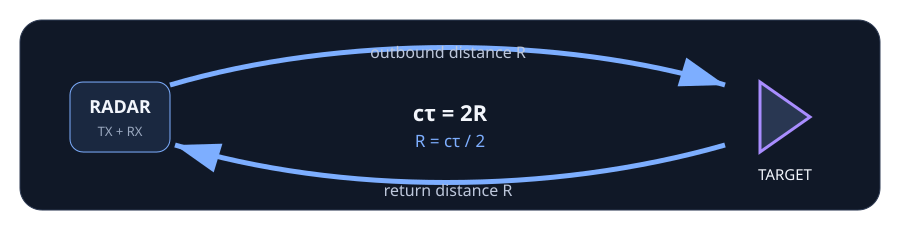

## Measure time first, then infer distance

A pulsed monostatic radar transmits a known waveform and records a delayed echo. The receiver does not directly measure meters; it measures **lag**.

For a round-trip delay $\tau$,

$$
2R = c\tau \qquad\Rightarrow\qquad R = \frac{c\tau}{2}.
$$

The factor of two matters because the pulse travels from the radar to the target **and back**.

Use the controls to separate three ideas that are often blurred together:

- the target's physical range;
- the integer lag grid imposed by the sample clock;
- the width and shape of the correlation response imposed by the waveform.

Turn on the broken formula after you understand the valid result. It changes only the geometry conversion and should produce exactly twice the reported range.

## Round-trip geometry

The measured delay covers both legs of the path. That is why a monostatic radar uses $R=c\tau/2$ rather than $R=c\tau$.
